.. contents:: **Table of Contents**

Sensitivity Mapping with MESA
=============================

MESA 4.0 is open source and free for anyone to use. It is based on the
Python coding language, but you do not need to be a coder to use the
tool! It is compiled into an easy-to-use app.

Citation
========

| Please use the following citation when using MESA in publications or
  reports:
| Larsen, R. (2024). MESA tool version 4.3 (4.3). Zenodo.
  https://doi.org/10.5281/zenodo.13750847

License
=======

Initial setup
=============

You can download the latest official version of the MESA app from here:
https://zenodo.org/communities/mesatool/records?q=&l=list&p=1&s=10&sort=newest

The download comes with example data which we will use in this tutorial.

Download and unzip the file. You will then see the below file structure:

|image1|

MESA 4.3– step by step tutorial
===============================

This section provides a step-by-step tutorial to guide users through the
process of producing a sensitivity atlas with the MESA tool.

6.1 Data preparation 
---------------------

.. _section-1:

6.1.2 Prepare input data
~~~~~~~~~~~~~~~~~~~~~~~~

The MESA tool transforms all asset layers and grids from their original
coordinate systems into EPSG:4326 (WGS84 Lat Long) for consistency. This
means that you do not need to do this manually before.

6.1.3 Preparing asset data
~~~~~~~~~~~~~~~~~~~~~~~~~~

All of your input asset data must be copied into the ‘asset’ folder
within the ‘input’ folder. This is where the MESA tool reads your asset
data from.

Your data can be in polygon, point or line format. The files and folders
should be given names that make it easy to know what the file is. For
example, a shapefile showing the location of seagrass should contain the
word ‘seagrass’ in the file name, along with anything else needed to
identify it from other similar files.

1. Copy your asset data into the ‘asset’ folder. If you are using the
   training data, it will already be in the folder, so you do not need
   to copy any data into here.

..

   |image2|

Your data can be arranged into folders (like the above) or all in the
same folder if you would rather. The data can be in shapefile or
geopackage format, or a combination of the two.

Please note, however, individual assets must be separated into
individual datasets, as each dataset will be treated uniformly.
Therefore, you can only assign a single sensitivity ranking per dataset.
For example, protected areas may require multiple sensitivity rankings
based on the legal importance associated with the designation (e.g.
National Park vs Forest Reserve) and so the dataset should be split into
multiple files.

2. Copy your geocode data into the ‘geocode’ folder. Again, if you are
   using the test data it will already be in there. Your ‘geocode’
   folder should look like this:

|image3|

The geocodes are delimited areas that are used to display your
sensitivity rankings on a map. They are most commonly grids of different
sizes but could also be other delimited areas such as districts. You can
use any grids for this, but we recommend using Quarter Degree Grid Cells
which can be downloaded for each country here:

https://zenodo.org/communities/qdgc/records?q=&l=list&p=1&s=10&sort=newest

Quarter Degree Grid Cells have global coverage and enables the use of
differently sized grid cells. Spatial grids for use at national level
have been developed [1]_ with grid cells ranging from 55 x 55 km (Level
1) to 850 x 850 m (Level 7). Smaller grid cells can be used to produce a
sensitivity atlas of a smaller area of focus if required.

You can run the MESA tool with all levels if you wish, but it may mean
it takes longer to run. You can instead choose only the levels that you
require to reduce processing time. You can also extract only the grid
cells that cover your area of interest.

Now you have your data in the correct places, you are ready to run the
tool.

6.2 Running the MESA tool
-------------------------

1. First, open the user interface by double clicking on the ‘mesa’
   application

|image4|

A window like the below should open, which may take a few seconds to
load. This is the user interface of the MESA tool, where you will run
the analysis.

|image5|

2. Click on the ‘Import’ button. This will open a new window, it may
   take a little while to open.

3. Click the ‘Import assets’ button. This will import the assets we
   saved in the ‘assets’ folder earlier.

|image6|

You will get a progress bar and once it is completed it will tell you in
the Log Output box. This may take a while to complete, depending on how
much asset data you have and the processing power of your computer. If
there are any errors, it will tell you in this Log Output box.

|image7|

4. Now it is time to import your geocodes. Click the ‘Import geocodes’
   button.

|image8|

See section 6.4 below which covers the ‘Import lines’ function. You can
ignore it for this part of the tutorial.

5. Click exit and go back to the main user interface. It will now show
   you how many asset and geocode layers you have imported.

|image9|

6. Next is to click the ‘Set up’ button, which is where we input our
   importance and susceptibility scores. This will open another new
   window with a separate line for each of your asset datasets.

|image10|

7. In this window we input our importance and susceptibility scores,
   which will have been decided upon with a variety of stakeholders.
   However, in this tutorial, to save time, we have come up with scores
   on our own. This should not be done in the real world.

..

   You can use the scores we use below or enter your own. Once you
   entered the scores, the sensitivity will be calculated for you.

|image11|

8. Click Save and then Exit

9. Go back to the home user interface again. It will now say that the
   setup is ok, but you can go back to adjust it at any time if needed.

|image12|

10. Now click the ‘Process’ button. This will open up another new
    window. This is where the tool combines the asset data, the geocode
    grids and the sensitivity values to produce the output.

11. Click ‘Process’

|image13|

12. This may take a little while to run, but once it is complete it will
    tell you and the progress bar will reach 100%.

|image14|

The results of this will be added to a geopackage in the Output folder.
You are able to view these in your choses GIS software (e.g. QGIS or
ArcGIS). See X for more information on the output files.

13. Once it is complete, click the ‘Exit’ button to close the window.

14. Go back to the main user interface again. It will now tell you that
    the processing is complete.

|image15|

15. The final step is to produce your atlas. Click on the ‘Atlas’
    button. This will open another new window.

16. Click ‘Create’. This will add your output files to a QGIS project.

|image16|

You are now able to view your outputs in a QGIS project. See below for
how to do this.

The key output is a geopackage [2]_. The geopackage contains seven
produced tables and an additional number of tables related to the number
of input asset layers (see Table 2). The tables can be queried using
QGIS or ArcGIS.

If you have included multiple geocode grids you will need to filter the
outputs to one geocode level. This is done for you in the QGIS project.

For more information on the tables and their attributes please refer to
Annex II\ **.**

*Table 2: List of output tables from the sensitivity processing.*

+-----------------------+----------------------------------------------+
| **Table name**        | **Description**                              |
+=======================+==============================================+
| **tbl                 | Copy of the input asset data (shapefile or   |
| _asset\_[assetname]** | other).                                      |
+-----------------------+----------------------------------------------+
| **t                   | Copy of all asset objects in the assets.     |
| bl_asset_allobjects** |                                              |
+-----------------------+----------------------------------------------+
| **tbl_full**          | All features resulting from the interaction  |
|                       | of each input asset with any grid cell.      |
+-----------------------+----------------------------------------------+
| **tbl_dissolved**     | Table resulting from merging/dissolving grid |
|                       | cells by the attri­butes                      |
|                       | *combo_sensitivity_max* and *grid_type.*     |
+-----------------------+----------------------------------------------+
| **tbl_grid_overview** | Table listing grid cells holding information |
|                       | from the calculations and spatial            |
|                       | relationships, each unique.                  |
+-----------------------+----------------------------------------------+
| **tbl_grid**          | All grids imported as part of the analysis.  |
+-----------------------+----------------------------------------------+
| **tbl_metadata**      | Table listing all metadata pertaining to the |
|                       | asset tables.                                |
+-----------------------+----------------------------------------------+
| **tbl_issues          | Table containing findings in original layers |
| _in_original_layers** | to be fixed by the user. All the elements in |
|                       | this table have been taken away from the     |
|                       | calculations.                                |
+-----------------------+----------------------------------------------+

6.3 Viewing your results
------------------------

Once you have run the MESA tool, including the create atlas section, you
can easily visualise your results in QGIS. Make sure you have an
up-to-date version of QGIS as this may not work with an old version.

You should always check your results are correct and that no mistakes
have been made when inputting the importance and susceptibility scores.

1. Go back to the MESA file that you have been working in and click on
   the ‘qgis’ folder

|image17|

In here there will be a QGIS project file called ‘mesa’

|image18|

2. Open the mesa QGIS project by double clicking on it. This will open
   QGIS (as long as you have QGIS installed on your computer)

If you have not ran all sections in the MESA tool, for example the
segments section, you may get a pop up saying there are some unavailable
layers. This is ok, just click on the ‘Keep Unavailable Layers’ button.

|image19|

You should now see your outputs displayed in QGIS similar to the below
(if you are not using the training data you may need to zoom to your
area).

|image20|

In the layers panel on the left hand side, you are able to select for
the different geocodes that you included in your analysis.

|image21|

|image22|\ |image23|

You can also select to view your original input data, among other
things. Have an explore.

|image24|\ |image25|

You can get more detailed information if you select one of the geocode
cells on the sensitivity layer. For example, you can see what
underlaying datasets are leading to the sensitivity score.

|image26|

6.4 Processing with lines rather than geocodes
----------------------------------------------

As well as running your analysis with geocodes, the MESA tool also has
the functionality to use lines instead. This can be useful if you are
particularly interested in a linear feature such as a river or
coastline. Using lines doesn’t provide as much detail as small grid
cells so you must consider whether it is suitable for your needs. It
also only considers asset data that fall within a buffer distance of
your choice.

|image27|\ |image28|

1. Add your line data to the ‘lines’ folder within the ‘input’ folder.
   This is where the MESA tool reads the line data from. The training
   data are shapefile lines of the coast of Zanzibar.

|image29|\ |image30|

2. From the main home interface window, select the ‘Import’ button
   again. This time click the ‘Import lines’ button.

|image31|

As before, the lines will start to be imported and once this is complete
the tool will let you know in the Log Output box.

3. Once complete, click Exit

4. Now click the ‘Segments’ button. This will open up another new
   window.

|image32|

The new window will look like this.

|image33|

5. Click the ‘Edit lines’ button.

A new window will open. This is where you can change the segment length
and width. The MSA tool will divide the lines you have imported up into
segments and buffer them. The default is set to segment lengths of 1000m
and a buffer width of 600m. You can change this however in this window.
You press the ‘Next’ button to scroll through the different lines you
imported.

|image34|

Below on the left, you can see what changing the segment length to
10,000m and width to 5000m looks like in comparison to the default
length/width on the right.

|image35| |image36|

The buffer width distance you chose will be the area that is considered
in the analysis. Only asset data within these areas will be considered.

6. Once you are happy with your length and width close this box. For
   this tutorial we have kept the default values.

7. Now click the ‘Process segments’ button. Once it has completed it
   will tell you in the Log Output box. When it is complete you can
   close this box by clicking the ‘Exit’ button.

|image37|

8. Open up your Mesa QGIS project file again and these new processed
   lines should be added. If they are not, try creating a new atlas (in
   the same way as you did above)

9. 

..

   |image38|

#. 

.. [1]
   National QDGC spatial grids are available for download at
   https://github.com/miljodir/mesa.

.. [2]
   As defined by the Open Geospatial Consortium. More information is
   available at: https://www.geopackage.org/.

.. |image1| image:: media/image1.png
   :width: 2.31382in
   :height: 2.25851in
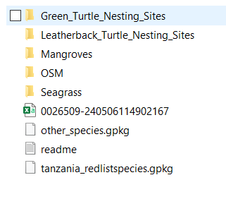
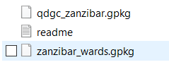
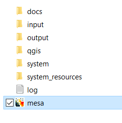

.. |image6| image:: media/image6.png
   :width: 5.41698in
   :height: 4.12606in
.. |image7| image:: media/image7.png
   :width: 5.3877in
   :height: 4.09062in
.. |image8| image:: media/image8.png
   :width: 5.12312in
   :height: 3.87498in
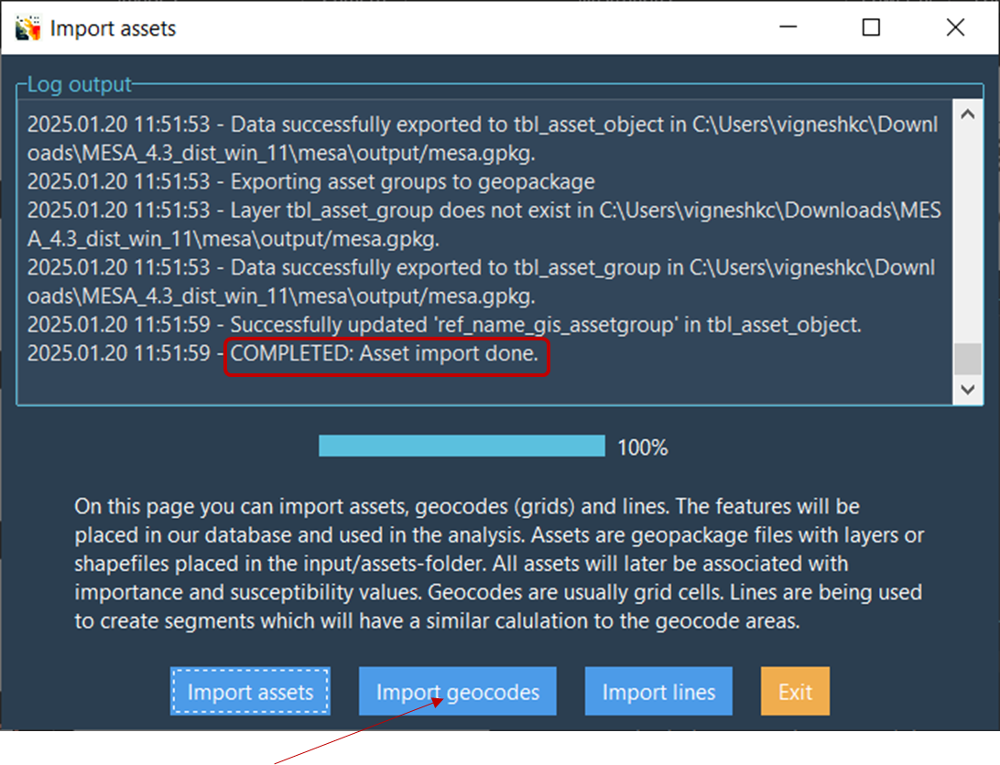
.. |image10| image:: media/image10.png
   :width: 3.7529in
   :height: 3.46144in
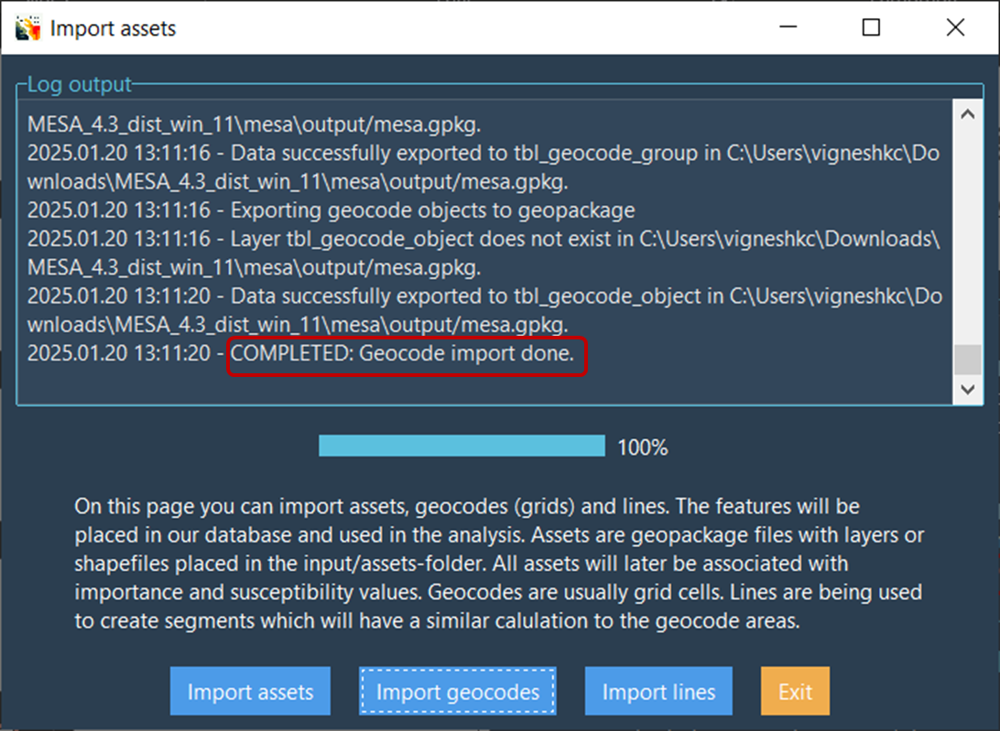

.. |image13| image:: media/image13.png
   :width: 5.97527in
   :height: 4.11834in
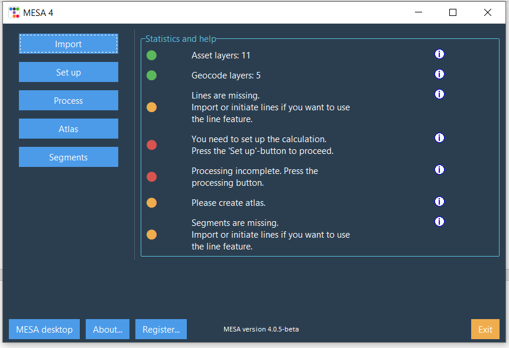
.. |image15| image:: media/image15.png
   :width: 6.26806in
   :height: 4.26667in

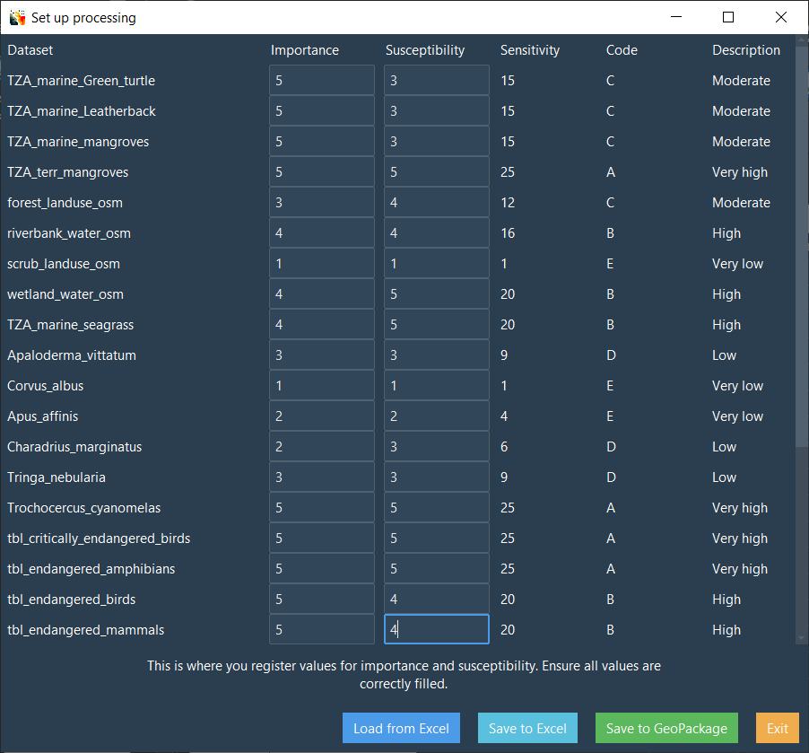
.. |image19| image:: media/image19.png
   :width: 6.26806in
   :height: 4.09375in
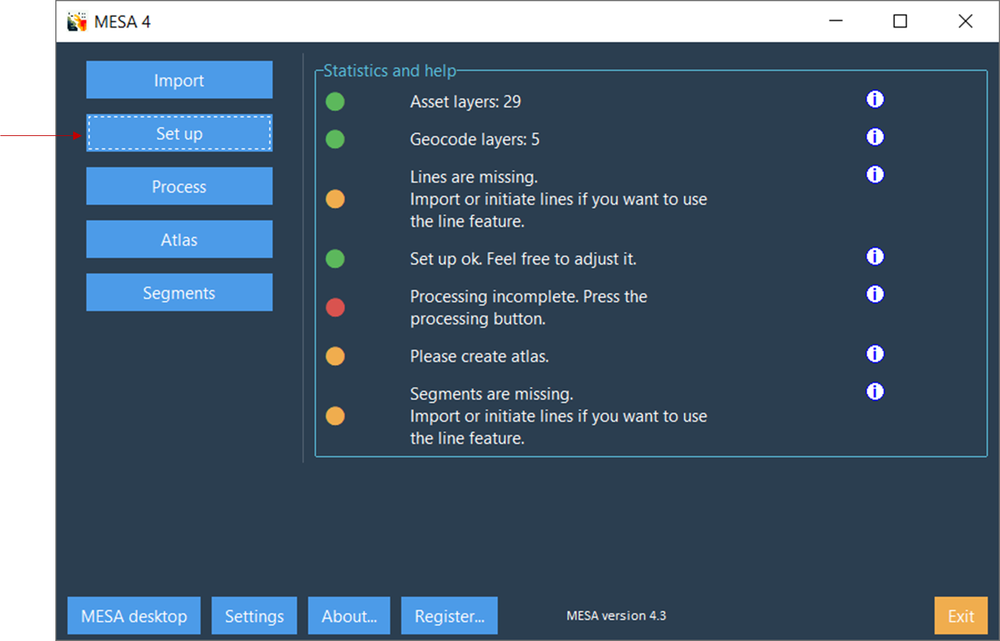

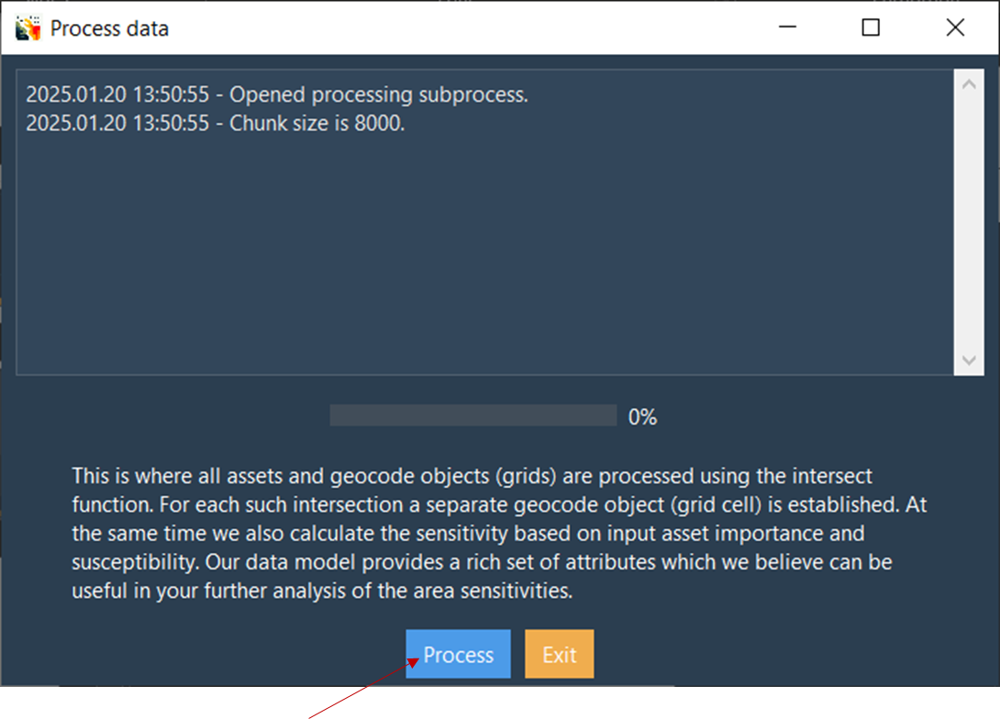

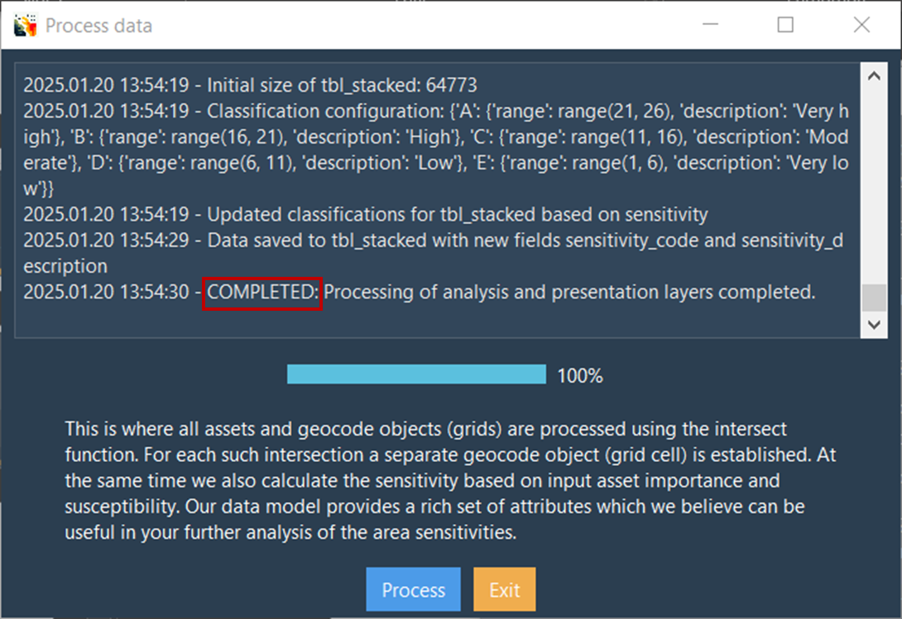

.. |image26| image:: media/image26.png
   :width: 6.26806in
   :height: 2.6125in

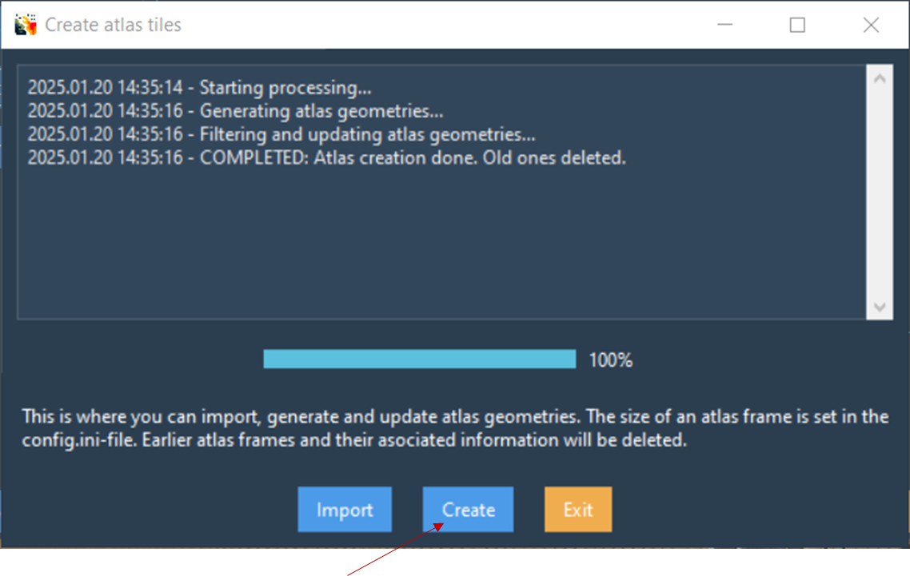

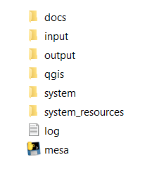
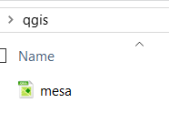
.. |image32| image:: media/image32.png
   :width: 5.11281in
   :height: 3.47746in
.. |image33| image:: media/image33.png
   :width: 6.26806in
   :height: 4.93125in
.. |image34| image:: media/image34.png
   :width: 6.26806in
   :height: 2.89236in
.. |image35| image:: media/image35.png
   :width: 2.98055in
   :height: 3.01295in

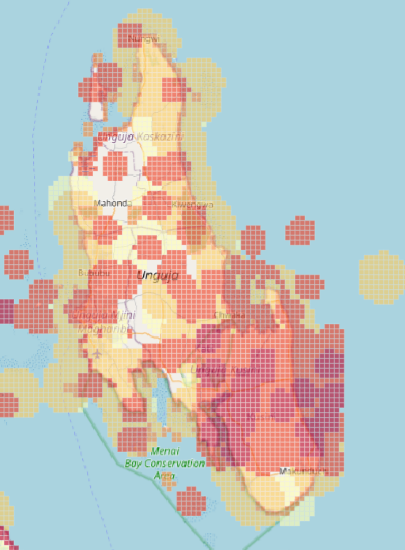
.. |image38| image:: media/image37.png
   :width: 6.26806in
   :height: 3.32708in
