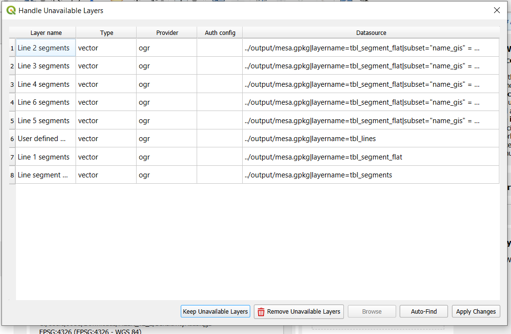
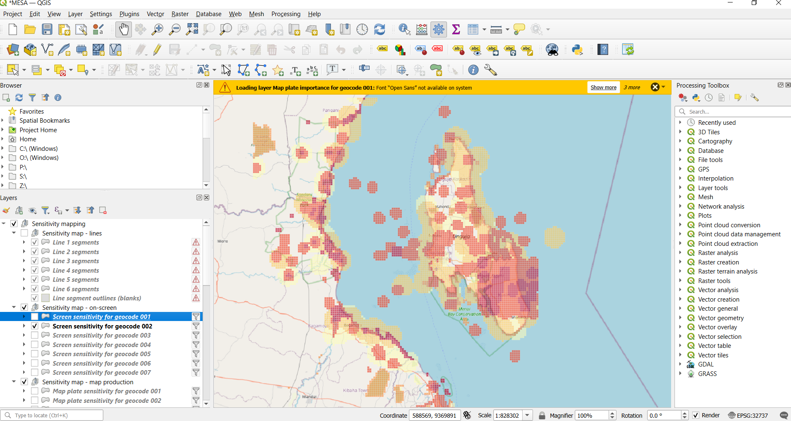
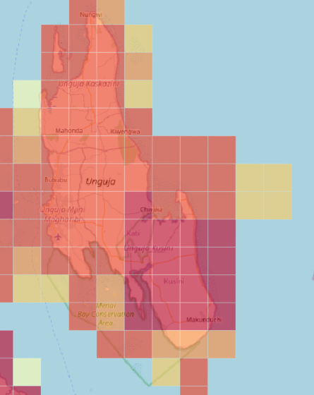
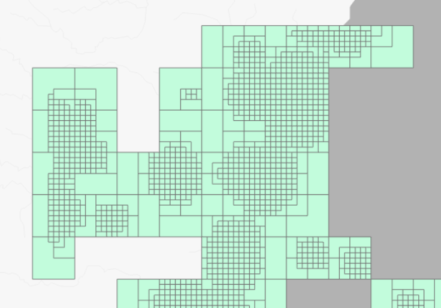

Sensitivity Mapping with MESA
=============================

The Mapping Environmentally Sensitive Assets (MESA) tool is designed for a broad audience involved in developing and using environmental sensitivity maps in various contexts. It provides a step-by-step protocol for creating an environmental sensitivity atlas using a standardized methodology developed after reviewing multiple existing methods. MESA 4.3 is based on the Python coding language. However, you do not need to be a coder to use the tool. It is compiled into an easy-to-use, open-source Windows application. The tool can be applied to a variety of purposes such as strategic planning, project management and emergency response. It also includes context-specific considerations to be made during the mapping process. 

Citation
========

| Please use the following citation when using MESA in publications or
  reports:
| Larsen, R. (2024). MESA tool (4.3). Zenodo.
  https://doi.org/10.5281/zenodo.13750847

License
=======

Creative Commons Attribution 4.0 International (`CC BY 4.0 <https://creativecommons.org/licenses/by/4.0/deed.en>`_).

Initial setup
=============

You can download the latest official version of the MESA app from here:
https://zenodo.org/communities/mesatool/records?q=&l=list&p=1&s=10&sort=newest

The download comes with example data which we will use in this tutorial.

Download and unzip the file. You will then see the below folder
structure (See Annex C for description of the folder structure):

|image1|

MESA 4.3– step by step tutorial
===============================

This section provides a step-by-step tutorial to guide users through the
process of producing a sensitivity atlas with the MESA tool.

1 Data preparation 
-------------------

.. _section-1:

1.1 Prepare input data
~~~~~~~~~~~~~~~~~~~~~~

The MESA tool transforms all asset layers and grids from their original
coordinate systems into EPSG:4326 (WGS84 Lat Long) for consistency. This
means you do not need to do this manually beforehand.

1.2 Preparing asset data
~~~~~~~~~~~~~~~~~~~~~~~~

All your input asset data must be copied into the ‘asset’ folder
within the ‘input’ folder. This is where the MESA tool reads your asset
data from.

Your data can be in polygon, point or line format. The files and folders
should be given names that make it easy to identify their contents. For
example, a shapefile showing the location of seagrass should contain the
word ‘seagrass’ in its file name, along with anything else needed to
distinguish it from other similar files.

1. Copy your asset data into the ‘asset’ folder. If you are using the
   training data, it will already be in the folder, so you do not need
   to copy any data into it.

..

   |image2|

Your data can be arranged into subfolders (as shown above) or placed all
in the same folder, depending on your preference. The data can be in
shapefile or geopackage format, or a combination of both. However, individual assets must be separated into their own datasets, as each dataset is treated uniformly. 
Therefore, you can only assign a single sensitivity ranking per dataset.
For example, protected areas may require multiple sensitivity rankings
based on the legal importance associated with their designation (e.g.
National Park vs Forest Reserve). In such cases, the dataset should be
split into multiple files.

2. Copy your geocode data into the ‘geocode’ folder. If you are
   using the test data, it will already be in the folder. Your ‘geocode’
   folder should look like this:

|image3|

The geocodes are delimited areas used to display your sensitivity
rankings on a map. They are most commonly grids of different sizes but
could also be other delimited areas, such as districts. You can use any
grids for this, but we recommend using Quarter Degree Grid Cells, which
can be downloaded for each country here:

https://zenodo.org/communities/qdgc/records?q=&l=list&p=1&s=10&sort=newest

Quarter Degree Grid Cells have global coverage and enables the use of
differently sized grid cells. Spatial grids for use at national level
have been developed with grid cells ranging from 55 x 55 km (Level
1) to 850 x 850 m (Level 7). Smaller grid cells can be used to produce a
sensitivity atlas of a smaller area of focus if required. National QDGC spatial grids are available for download at https://github.com/miljodir/mesa.

You can run the MESA tool with all levels if you wish, but this may
increase processing time. You can instead choose only the levels that
you require to reduce processing time. You can also extract only the
grid cells that cover your area of interest.

Now that you have your data saved in the correct locations, you are
ready to run the tool.

2 Running the MESA tool
-----------------------

1. First, open the user interface by double clicking on the ‘mesa’
   application.

|image4|

A window like the one below should open. It may take a few seconds to
load. This is the user interface of the MESA tool, where you will run
your analysis.

|image5|

2. Click on the ‘Import’ button. This will open a new window. It may
   take some time to open.

3. Click the ‘Import assets’ button. This will import the assets we
   saved in the ‘assets’ folder earlier.

..

   |image6|

You will see a progress bar. Once the process is complete, a
notification will appear in the Log Output box. This may take some time, depending on the amount of asset data and the
processing power of your computer. If any errors occur, they will also be displayed in the Log Output box. 

|image7|

4. Import your geocodes by clicking the ‘Import geocodes’ button.

|image8|

See section 4 below for details on the ‘Import lines’ function. You can
ignore it for this part of the tutorial.

5. Click Exit to return to the main user interface. It will now show how
   many asset and geocode layers you have imported.

|image9|

6. Click the ‘Set up’ button to input the importance and susceptibility
   scores. This will open a new window with a separate line for each of
   your asset datasets.

|image10|

7. In this window, input your importance and susceptibility scores,
   which should be decided in collaboration with relevant stakeholders.
   However, in this tutorial, to save time, we have created hypothetical
   scores. Please note that this is for demonstration purposes only and
   should not be used in real-world scenarios.

..

   You can either use the example scores we use below or enter your own.
   Once the scores are entered, the sensitivity values will be
   calculated.

|image11|

Alternatively, you can input these scores from an excel file using the
‘Load from Excel’ button. The Excel file needs to have the following
columns (see example below):

- name_original: asset name

- susceptibility: susceptibility score (1-5)

- importance: importance score (1-5)

|image12|

8. Click ‘Save to GeoPackage’, then Exit. You can also save it as an Excel file if needed using the ‘Save to Excel’ button.

9. Return to the home user interface again. It will now indicate that the setup is ok, but you can go back to adjust it any time if needed.

|image13|

10. Click the ‘Process’ button. This will open a new window where the
    tool will combine the asset data, geocode grids and the sensitivity
    values to produce the output.

11. Click ‘Process’.

|image14|

12. This step may take some time to run. Once the process is complete,
    the progress bar will reach 100% and it will display a COMPLETED
    notification.

|image15|

The results will be saved in a geopackage file in the Output folder. You
can view them in your chosen GIS software (e.g. QGIS or ArcGIS). See
Annex B for more information on the output files.

13. Once the processing is complete, click the ‘Exit’ button to close
    the window.

14. Return to the main user interface. It will now show you that the
    processing is complete.

|image16|

15. The final step is to produce your atlas. Click the ‘Atlas’ button.
    This will open another new window.

16. Click ‘Create’. This will add your output files to a QGIS project.

|image17|

You will now be able to view your outputs in a QGIS project. See below
for how to do this.

The key output is a geopackage,[1]_ which contains seven produced
tables as well as additional tables corresponding to the number of input
asset layers (see Table 2). These tables can be queried using QGIS or
ArcGIS.

If you have included multiple geocode grids, you will need to filter the
outputs to a single geocode level. This is done for you in the QGIS
project.

For more information on the tables and their attributes, refer to
Annex B\ **.**

*Table 2: List of output tables from the sensitivity processing.*

+-----------------------------------------+----------------------------+
| **Table name**                          | **Description**            |
+=========================================+============================+
|                                         |                            |
+-----------------------------------------+----------------------------+
| **mesa — tbl_asset_group**              | Table listing metadata     |
|                                         | pertaining to the assets.  |
+-----------------------------------------+----------------------------+
| **mesa — tbl_asset_object**             | List of all asset objects  |
|                                         | in the assets              |
+-----------------------------------------+----------------------------+
| **mesa — tbl_atlas**                    | Contains spatial data and  |
|                                         | ids of atlases             |
+-----------------------------------------+----------------------------+
| **mesa — tbl_flat**                     | Table with list of         |
|                                         | intersected geocodes with  |
|                                         | assets                     |
+-----------------------------------------+----------------------------+
| **mesa — tbl_geocode_group**            | Table listing all unique   |
|                                         | geocodes imported for the  |
|                                         | analysis.                  |
+-----------------------------------------+----------------------------+
| **mesa — tbl_geocode_object**           | List of fixed geocodes     |
+-----------------------------------------+----------------------------+
| **mesa — tbl_stacked**                  | All features resulting     |
|                                         | from the interaction of    |
|                                         | each input asset with any  |
|                                         | grid cell                  |
+-----------------------------------------+----------------------------+
| **mesa —** **tbl_asset_group_issue**    | Table containing original  |
|                                         | layers that need to be     |
|                                         | fixed by the user. All the |
|                                         | elements in this table     |
|                                         | have been skipped in the   |
|                                         | calculations               |
+-----------------------------------------+----------------------------+

3 Viewing your results
----------------------

Once you have run the MESA tool, including the ‘Create Atlas’ section,
you can easily visualize your results in QGIS. Make sure you have an
up-to-date version of QGIS as older versions may not be compatible.

You should always verify that your results are correct and that no
mistakes were made when inputting the importance and susceptibility
scores.

1. Go to the MESA folder that you have been working in and click on the
   ‘qgis’ folder.

|image18|

Inside, you will find a QGIS project file called ‘mesa’.

|image19|

2. Open the mesa QGIS project by double clicking on it. This will open
   QGIS (as long as you have QGIS installed on your computer)

If you have not run all sections in the MESA tool, for example the segments section, you may see a pop up indicating that some layers are unavailable. This is expected. Simply click on the ‘Keep Unavailable Layers’ button. 

|image20|

You should now see your outputs displayed in QGIS, similar to the
example below (if you are not using the training data you may need to
zoom into your area of interest).

|image21|

*The boundaries and names shown and the designations used on this map do not imply official endorsement or acceptance by the United Nations.*

In the Layers panel on the left-hand side, you can select the different
geocodes you have included in your analysis.

|image22|

|image23|\ |image24|

You can also view your original input data, among other layers.

|image25|\ |image26|

You can get more detailed information if you select one of the geocode
cells in the sensitivity layer. For example, you can see which
underlaying datasets contributed to the sensitivity score.

|image27|

4 Processing with lines instead of geocodes
-------------------------------------------

In addition to running your analysis with geocodes, the MESA tool also
has the functionality to use lines instead. This can be useful if you
are particularly interested in a linear feature such as a river or
coastline. However, using lines does not provide as much detail as small
grid cells. You should consider whether it is suitable for your needs.
It also only considers asset data that fall within a buffer distance of
your choice.

|image28|\ |image29|

*The boundaries and names shown and the designations used on this map do not imply official endorsement or acceptance by the United Nations.*

1. Add your line data to the ‘lines’ folder within the ‘input’ folder.
   This is where the MESA tool reads the line data from. The training
   data are shapefile lines of the coast of Zanzibar.

|image30|\ |image31|

2. In the main home interface window, select the ‘Import’ button again.
   This time click the ‘Import lines’ button.

|image32|

The lines will start to import, and once this is complete, the tool will
let you know in the Log Output box.

3. Once complete, click Exit.

4. Now click the ‘Segments’ button. This will open a new window.

|image33|
 
5. Click the ‘Process segments’ button. Once it has completed, it will
   notify you in the Log Output box. Once finished, close the box by
   clicking the ‘Exit’ button.

|image34| 

6. Reopen your Mesa QGIS project file. The newly processed lines should
   be added. If they are not, try creating a new atlas (in the same way
   as described above).

   |image35|

*The boundaries and names shown and the designations used on this map do not imply official endorsement or acceptance by the United Nations.*

The MESA tool will divide the lines you have imported into segments and buffer them. The default is set to segment lengths of 1000m and a buffer width of 600m. You can change this if needed by following these steps. 

1. Click the ‘Settings’ button.

|image64|

2. Select ‘Edit lines’.

|image65|

3. A new window will open. This is where you can change the segment length and width. 

|image66|

4. Press the ‘Next’ button to scroll through the different lines that you imported. Change the segment length and width as needed and select ‘Save’. Below on the left, you can see what changing the segment length to 10000m and width to 5000m looks like in comparison to the default length/width on the right.  

|image67|\ |image68|

*The boundaries and names shown and the designations used on this map do not imply official endorsement or acceptance by the United Nations.*

Annex A: Data standards
=======================

Standards for asset datasets. 
------------------------------

File format
^^^^^^^^^^^

Data are to be provided in shapefile or geopackage format and contain either:

- Points

- Lines

- Polygons

It is the user’s responsibility to ensure the data are accurate. Understanding and documenting the key attributes of each dataset is
essential. However, this process can be time-consuming. Below you can
find a general-purpose schema that you can tailor to meet your specific
needs.

Attribute data
~~~~~~~~~~~~~~

Only limited attribute data are required to generate an overall environmental sensitivity atlas. However, including attribute data adds drill-down functionality, which can improve the value of the atlas. Users can inspect attribute data to better understand the underlying assets related to an area’s sensitivity.

Here are some example data standards for different types of assets based on best practices. While it may not be feasible to complete all fields for every asset, data providers should focus on including the key attributes.

Protected Areas
~~~~~~~~~~~~~~~

Data standards for protected areas have been drawn from the minimum
required attribute data for inclusion in the World Database of Protected
Areas (WDPA). The requirements are outlined in Table A1 below, with
more detailed descriptions available in Appendix 1 of the `WDPA User
Manual <http://pp-import-production.s3.amazonaws.com/WDPA_Manual_1_5.pdf>`__.

*Table A1. Description and allowed values for attributes of protected
area data.*

+-----------------+----------+------------+------------------------------------------+
| **Field Name**  | **Type** | **Length** | **Allowed Values**                       |
+=================+==========+============+==========================================+
| PA_DEF          | Text     | 20         | **Allowed values**: 1 (meets IUCN and/or |
|                 | (String) |            | CBD PA definition); 0 (does not meet     |
|                 |          |            | IUCN and/or CBD PA definition)           |
+-----------------+----------+------------+------------------------------------------+
| NAME            | Text     | 254        | Name of the protected area (PA) as       |
|                 | (String) |            | provided                                 |
+-----------------+----------+------------+------------------------------------------+
| ORIG_NAME       | Text     | 254        | Name of the protected area in original   |
|                 | (String) |            | language                                 |
+-----------------+----------+------------+------------------------------------------+
| DESIG           | Text     | 254        | Name of designation                      |
|                 | (String) |            |                                          |
+-----------------+----------+------------+------------------------------------------+
| DESIG_TYPE      | Text     | 20         | **Allowed values**: National, Regional,  |
|                 | (String) |            | International, Not applicable            |
+-----------------+----------+------------+------------------------------------------+
| MARINE          | Text     | 20         | **Allowed values**: 0 (100% Terrestrial  |
|                 | (String) |            | PA), 1 (Coastal: marine and terrestrial  |
|                 |          |            | PA), 2 (100% Marine PA)                  |
+-----------------+----------+------------+------------------------------------------+
| REP_M_AREA      | Number   | N/A        | Marine area in square kilometres         |
|                 | (Double) |            |                                          |
+-----------------+----------+------------+------------------------------------------+
| REP_AREA        | Number   | N/A        | Area in square kilometres                |
|                 | (Double) |            |                                          |
+-----------------+----------+------------+------------------------------------------+
| STATUS          | Text     | 100        | **Allowed values**: Proposed, Inscribed, |
|                 | (String) |            | Adopted, Designated, Established         |
+-----------------+----------+------------+------------------------------------------+
| STATUS_YR       | Number   | 12         | Year of enactment of status              |
|                 | (Long    |            |                                          |
|                 | Integer) |            |                                          |
+-----------------+----------+------------+------------------------------------------+
| PARENT_ISO3     | Text     | 20         | **Allowed values**: ISO 3166-3 character |
|                 | (String) |            | code of country where the PA is located. |
+-----------------+----------+------------+------------------------------------------+
| ISO3            | Text     | 20         | **Allowed values**: ISO3166-3 character  |
|                 | (String) |            | code of country or territory where the   |
|                 |          |            | PA is located                            |
+-----------------+----------+------------+------------------------------------------+
| GOV_TYPE        | Text     | 254        | **Allowed values**: Federal or national  |
|                 | (String) |            | ministry or agency, Sub-national         |
|                 |          |            | ministry or agency, Government-delegated |
|                 |          |            | management, Transboundary governance,    |
|                 |          |            | Collaborative governance, Joint          |
|                 |          |            | governance, Individual landowners,       |
|                 |          |            | Non-profit organisations, For-profit     |
|                 |          |            | organisations, Indigenous peoples, Local |
|                 |          |            | communities, Not Reported                |
+-----------------+----------+------------+------------------------------------------+
| MANG_AUTH       | Text     | 254        | Individual or group that manages the     |
|                 | (String) |            | protected area                           |
+-----------------+----------+------------+------------------------------------------+
| IUCN_CAT        | Text     | 20         | **Allowed values**: Ia, Ib, II, III, IV, |
|                 | (String) |            | V, VI, Not Applicable, Not Assigned, Not |
|                 |          |            | Reported                                 |
+-----------------+----------+------------+------------------------------------------+
Other Biodiversity Designations
~~~~~~~~~~~~~~~~~~~~~~~~~~~~~~~

Data standards for Other Biodiversity Designations are based around the
proposed Key Biodiversity Area data standards (Table A2). However,
environmental sensitivity mapping does not require the same level of
details, and some fields are therefore omitted.

*Table A2. Description and allowed values for attributes of Other
Biodiversity Designations data.*

+---------------------+------------+------------+---------------------------------------------------------+
| **Field Name**      | **Type**   | **Length** | **Allowed Values**                                      |
+=====================+============+============+=========================================================+
| NAME                | Text       | 254        | Name of the area as provided                            |
|                     | (String)   |            |                                                         |
+---------------------+------------+------------+---------------------------------------------------------+
| ORIG_NAME           | Text       | 254        | Name of the area in original                            |
|                     | (String)   |            | language                                                |
+---------------------+------------+------------+---------------------------------------------------------+
| DESIG               | Text       | 20         | **Allowed values**: KBA, AZE                            |
|                     | (String)   |            |                                                         |
+---------------------+------------+------------+---------------------------------------------------------+
| CRIT_MET            | Text       | 20         | **Allowed values**: AZE, A1, A2, B1, B2, B3, B4, C, D1, |
|                     | (String)   |            | D2, D3, E                                               |
+---------------------+------------+------------+---------------------------------------------------------+
| TRIGGER             | Text       | 254        | Name of the species, ecosystem type, or biological      |
|                     | (String)   |            | process triggering designation                          |
+---------------------+------------+------------+---------------------------------------------------------+
| MARINE              | Text       | 20         | **Allowed values**: 0 (100% Terrestrial), 1 (Coastal:   |
|                     | (String)   |            | marine and terrestrial), 2 (100% Marine)                |
+---------------------+------------+------------+---------------------------------------------------------+
| REP_M_AREA          | Number     | N/A        | Marine area in square kilometres                        |
|                     | (Double)   |            |                                                         |
+---------------------+------------+------------+---------------------------------------------------------+
| REP_AREA            | Number     | N/A        | Area in square kilometres                               |
|                     | (Double)   |            |                                                         |
+---------------------+------------+------------+---------------------------------------------------------+
| YEAR                | Number     | 12         | Year of designation                                     |
|                     | (Long      |            |                                                         |
|                     | Integer)   |            |                                                         |
+---------------------+------------+------------+---------------------------------------------------------+
| PARENT_ISO3         | Text       | 20         | **Allowed values**: SIO 3166-3 character code of        |
|                     | (String)   |            | country where the PA is located                         |
+---------------------+------------+------------+---------------------------------------------------------+
| ISO3                | Text       | 20         | **Allowed values**: ISO3166-3 character code of         |
|                     | (String)   |            | country or territory where the PA is located            |
+---------------------+------------+------------+---------------------------------------------------------+
Habitats
~~~~~~~~

Habitat datasets are likely to be more variable in nature than Protected
Areas and Other Biodiversity Designations, reflecting a level of
national and local specificity. As a result, the data standards (Table
A3) are less prescriptive.

*Table A3: Description and allowed values for attributes of habitat
data.*

+-----------------+----------+------------+----------------------------------------+
| **Field Name**  | **Type** | **Length** | **Allowed Values**                     |
+=================+==========+============+========================================+
| TYPE            | Text     | 20         | Name of habitat type                   |
|                 | (String) |            |                                        |
+-----------------+----------+------------+----------------------------------------+
| MARINE          | Text     | 20         | **Allowed values**: 0 (100%            |
|                 | (String) |            | Terrestrial), 1 (Coastal: marine and   |
|                 |          |            | terrestrial), 2 (100% Marine)          |
+-----------------+----------+------------+----------------------------------------+
| REP_M_AREA      | Number   | N/A        | Marine area in square kilometres       |
|                 | (Double) |            |                                        |
+-----------------+----------+------------+----------------------------------------+
| REP_AREA        | Number   | N/A        | Area in square kilometres              |
|                 | (Double) |            |                                        |
+-----------------+----------+------------+----------------------------------------+
| PARENT_ISO3     | Text     | 20         | **Allowed values**: ISO 3166-3         |
|                 | (String) |            | character code of country where the PA |
|                 |          |            | is located                             |
+-----------------+----------+------------+----------------------------------------+
| ISO3            | Text     | 20         | **Allowed values**: ISO3166-3          |
|                 | (String) |            | character code of country or territory |
|                 |          |            | where the PA is located                |
+-----------------+----------+------------+----------------------------------------+
| OTHER           | Text     | 254        | Additional relevant information        |
|                 | (String) |            | specific to the habitat                |
+-----------------+----------+------------+----------------------------------------+
Species
~~~~~~~

Species datasets vary depending upon the level of study that has been conducted. It is assumed that for species with spatial datasets available, sufficient study has been carried out to complete each of the attributes in Table A4 below, however it is possible that some may not be applicable or known.

*Table A4: Description and allowed values for attributes of species
data.*

+-----------------+------------+-------------+-----------------------------------------+
| **Field Name**  | **Type**   | **Length**  | **Allowed Values**                      |
+=================+============+=============+=========================================+
| SPECIES         | Text       | 100         | Name of species                         |
|                 | (String)   |             |                                         |
+-----------------+------------+-------------+-----------------------------------------+
| IUCN_STATUS     | Text       | 20          | **Allowed values**: CR, EN, VU, NT, LC, |
|                 | (String)   |             | DD, NE                                  |
+-----------------+------------+-------------+-----------------------------------------+
| NAT_STATUS      | Text       | 100         | Status under national assessment or     |
|                 | (String)   |             | legislation                             |
+-----------------+------------+-------------+-----------------------------------------+
| TYPE            | Text       | 20          | **Allowed values**: F (Feeding Ground), |
|                 | (String)   |             | B (Breeding Ground), M (Migratory       |
|                 |            |             | Route), O (Multiple use or Other)       |
+-----------------+------------+-------------+-----------------------------------------+
| HABITAT         | Text       | 254         | Species habitat preference if known.    |
|                 | (String)   |             |                                         |
+-----------------+------------+-------------+-----------------------------------------+
| MARINE          | Text       | 20          | **Allowed values**: 0 (100%             |
|                 | (String)   |             | Terrestrial), 1 (Coastal: marine and    |
|                 |            |             | terrestrial), 2 (100% Marine)           |
+-----------------+------------+-------------+-----------------------------------------+
| REP_M_AREA      | Number     | N/A         | Marine area in square kilometres        |
|                 | (Double)   |             |                                         |
+-----------------+------------+-------------+-----------------------------------------+
| REP_AREA        | Number     | N/A         | Area in square kilometres               |
|                 | (Double)   |             |                                         |
+-----------------+------------+-------------+-----------------------------------------+
| PARENT_ISO3     | Text       | 20          | **Allowed values**: SIO 3166-3          |
|                 | (String)   |             | character code of country where the PA  |
|                 |            |             | is located                              |
+-----------------+------------+-------------+-----------------------------------------+
| ISO3            | Text       | 20          | **Allowed values**: ISO3166-3 character |
|                 | (String)   |             | code of country or territory where the  |
|                 |            |             | PA is located                           |
+-----------------+------------+-------------+-----------------------------------------+
| OTHER           | Text       | 254         | Additional relevant information         |
|                 | (String)   |             | specific to the species                 |
+-----------------+------------+-------------+-----------------------------------------+

Metadata standards
------------------

In addition to data relating to individual assets, it is important for asset datasets to have metadata associated with them. This enables clear understanding of the content, source and age of the dataset. Maintaining metadata in a standard format, such as in Table A5 below, helps users and data managers efficiently manage datasets and easily identify those that need updating. 

*Table A5: Description and allowed values for attributes of species.*

+--------------------+-------------------------------------------------+
| **Field**          | **Allowed Values**                              |
+====================+=================================================+
| Dataset Type       | 1. Protected Area                               |
|                    |                                                 |
|                    | 2. Other Biodiversity Designation               |
|                    |                                                 |
|                    | 3. Habitat                                      |
|                    |                                                 |
|                    | 4. Species                                      |
+--------------------+-------------------------------------------------+
| Data Format        | 1. Polygon                                      |
|                    |                                                 |
|                    | 2. Polyline                                     |
|                    |                                                 |
|                    | 3. Point                                        |
+--------------------+-------------------------------------------------+
| Resolution         | Resolution of the dataset                       |
+--------------------+-------------------------------------------------+
| Last Updated       | Year of last update                             |
+--------------------+-------------------------------------------------+
| Maintenance        | 1.  Continual                                   |
| Frequency          |                                                 |
|                    | 2.  Daily                                       |
|                    |                                                 |
|                    | 3.  Weekly                                      |
|                    |                                                 |
|                    | 4.  Fortnightly                                 |
|                    |                                                 |
|                    | 5.  Monthly                                     |
|                    |                                                 |
|                    | 6.  Quarterly                                   |
|                    |                                                 |
|                    | 7.  Biannually                                  |
|                    |                                                 |
|                    | 8.  Annually                                    |
|                    |                                                 |
|                    | 9.  AsNeeded                                    |
|                    |                                                 |
|                    | 10. Irregular                                   |
|                    |                                                 |
|                    | 11. NotPlanned                                  |
|                    |                                                 |
|                    | 12. Unknown                                     |
+--------------------+-------------------------------------------------+
| Data Provider      | Organisation responsible for maintaining the    |
|                    | dataset                                         |
+--------------------+-------------------------------------------------+
| Restrictions       | Level of restrictions placed on dissemination   |
|                    | of the dataset.                                 |
|                    |                                                 |
|                    | E.g.:                                           |
|                    |                                                 |
|                    | 1. No dissemination                             |
|                    |                                                 |
|                    | 2. Within organisation only                     |
|                    |                                                 |
|                    | 3. Within government institutions only          |
|                    |                                                 |
|                    | 4. Selected external organisations              |
|                    |                                                 |
|                    | 5. Public                                       |
+--------------------+-------------------------------------------------+
| Person Responsible | Name and email of the point of contact for the  |
|                    | data set                                        |
+--------------------+-------------------------------------------------+

Annex B: Tables
================

mesa — tbl_asset layer\_[layer number]
--------------------------------------

List of the input asset data, with one table per input asset layer (Table B1).
These datasets are not added to the output geopackage file.

*Table B1. Description of attributes of mesa – tbl_asset layer_[layer number]*

+-------------------------+--------------------------------------------+
| **Attribute name**      | **Description**                            |
+=========================+============================================+
| fid                     | ID number                                  |
+-------------------------+--------------------------------------------+
| asset_group_name        | Asset name                                 |
+-------------------------+--------------------------------------------+
| attributes              | Metadata as per documentation available    |
+-------------------------+--------------------------------------------+
| process                 | True/false values indicating if it was     |
|                         | included in the processing or not          |
+-------------------------+--------------------------------------------+
| ref_asset_group         | Unique global id assigned for this         |
|                         | particular asset object                    |
+-------------------------+--------------------------------------------+
| ref_name_gis_assetgroup | Unique display name for this particular    |
|                         | asset object                               |
+-------------------------+--------------------------------------------+

mesa — tbl_asset_group 
----------------------------------

|image36| 

Table B2 lists from each asset and grid level involved in the
process. The bounding box for each layer is extracted as its geometry.

*Table B2. Description of attributes of mesa — tbl_asset_group*

+-----------------------------------+----------------------------------+
| **Attribute name**                | **Description**                  |
+===================================+==================================+
| fid                               | ID number                        |
+-----------------------------------+----------------------------------+
| id                                | ID number                        |
+-----------------------------------+----------------------------------+
| name_original                     | Name of the asset is usually     |
|                                   | asset file name                  |
+-----------------------------------+----------------------------------+
| Name_gis_assetgroup               | Asset name displayed in output   |
+-----------------------------------+----------------------------------+
| title_fromuser                    | User defined asset name          |
+-----------------------------------+----------------------------------+
| date_import                       | Date of import of asset          |
+-----------------------------------+----------------------------------+
| total_asset_objects               | Number of asset objects          |
+-----------------------------------+----------------------------------+
| importance                        | Assigned importance value        |
+-----------------------------------+----------------------------------+
| susceptibility                    | Assigned susceptibility value    |
+-----------------------------------+----------------------------------+
| sensitivity                       | Assigned sensitivity value       |
+-----------------------------------+----------------------------------+
| sensitivity_code                  | Assigned sensitivity code        |
|                                   | (A/B/C/D/E)                      |
+-----------------------------------+----------------------------------+
| sensitivity_description           | Sensitivity description (very    |
|                                   | low to very high)                |
+-----------------------------------+----------------------------------+

mesa — tbl_asset_object
-----------------------

Table B3 contains a list of all spatial objects from the input asset
layers.

*Table B3. Description of attributes of mesa — tbl_asset_object*

+-------------------------+--------------------------------------------+
| **Attribute name**      | **Description**                            |
+=========================+============================================+
| fid                     | ID number                                  |
+-------------------------+--------------------------------------------+
| asset_group_name        | Asset name                                 |
+-------------------------+--------------------------------------------+
| attributes              | Metadata as per documentation available    |
+-------------------------+--------------------------------------------+
| process                 | True/false values indicating if it was     |
|                         | included in the processing or not          |
+-------------------------+--------------------------------------------+
| ref_asset_group         | Unique global id assigned for this         |
|                         | particular asset object                    |
+-------------------------+--------------------------------------------+
| ref_name_gis_assetgroup | Unique display name for this particular    |
|                         | asset object                               |
+-------------------------+--------------------------------------------+

mesa — tbl_atlas
---------------------------

|image37|

Table B4 contains geometries used to create an atlas in the QGIS
project file.

*Table B4. Description of attributes of mesa — tbl_atlas*

+-------------------------+--------------------------------------------+
| **Attribute name**      | **Description**                            |
+=========================+============================================+
| fid                     | ID number                                  |
+-------------------------+--------------------------------------------+
| id                      | ID number                                  |
+-------------------------+--------------------------------------------+
| name_gis                | Atlas name                                 |
+-------------------------+--------------------------------------------+
| title_user              | Map title                                  |
+-------------------------+--------------------------------------------+
| description             | Atlas description                          |
+-------------------------+--------------------------------------------+
| image_name_1            | Image name                                 |
+-------------------------+--------------------------------------------+
| image_desc_1            | Image description                          |
+-------------------------+--------------------------------------------+
| image_name_1            | Image name                                 |
+-------------------------+--------------------------------------------+
| image_desc_2            | Image description                          |
+-------------------------+--------------------------------------------+

mesa — tbl_flat
--------------------------

|image38|

Table B5 contains all intersected geocodes at all levels. Data on
importance, susceptibility and sensitivity (code and value) have been
added.

*Table B5. Description of attributes of mesa — tbl_flat*

+-------------------------+--------------------------------------------+
| **Attribute name**      | **Description**                            |
+=========================+============================================+
| fid                     | ID number                                  |
+-------------------------+--------------------------------------------+
| code                    | Unique identifier for each geocode cell    |
+-------------------------+--------------------------------------------+
| importance_min          | Minimum importance value in this geocode   |
|                         | cell                                       |
+-------------------------+--------------------------------------------+
| importance_max          | Maximum importance value in this geocode   |
|                         | cell                                       |
+-------------------------+--------------------------------------------+
| sensitivity_min         | Minimum sensitivity value in this geocode  |
|                         | cell                                       |
+-------------------------+--------------------------------------------+
| sensitivity_max         | Maximum sensitivity value in this geocode  |
|                         | cell                                       |
+-------------------------+--------------------------------------------+
| susceptibility_min      | Minimum susceptibility value in this       |
|                         | geocode cell                               |
+-------------------------+--------------------------------------------+
| susceptibility_max      | Maximum susceptibility value in this       |
|                         | geocode cell                               |
+-------------------------+--------------------------------------------+
| ref_geocodegroup        | Geocode group ID number                    |
+-------------------------+--------------------------------------------+
| name_gis_geocodegroup   | Geocode group name                         |
+-------------------------+--------------------------------------------+
| asset_group_names       | Names of overlapping asset groups          |
+-------------------------+--------------------------------------------+
| asset_groups_total      | Number of asset groups                     |
+-------------------------+--------------------------------------------+
| area_m2                 | Area in m2 of asset object                 |
+-------------------------+--------------------------------------------+
| assets_overlap_total    | Number of overlapping assets               |
+-------------------------+--------------------------------------------+
| sensitivity_code_min    | Minimum sensitivity code in this geocode   |
|                         | cell (A/B/C/D/E)                           |
+-------------------------+--------------------------------------------+
| sens                    | Minimum sensitivity description in this    |
| itivity_description_min | geocode cell (very low to very high)       |
+-------------------------+--------------------------------------------+
| sensitivity_code_max    | Maximum sensitivity code in this geocode   |
|                         | cell (A/B/C/D/E)                           |
+-------------------------+--------------------------------------------+
| sens                    | Maximum sensitivity description in this    |
| itivity_description_max | geocode cell (very low to very high)       |
+-------------------------+--------------------------------------------+

.. _section-2:

mesa — tbl_geocode_group 
------------------------------------
|image39|

Table B6 contains all the unique geocode group names and ID. The bounding
box for each group is extracted as its geometry.

*Table B6. Description of attributes of mesa — tbl_geocode_group*

+-------------------------+--------------------------------------------+
| **Attribute name**      | **Description**                            |
+=========================+============================================+
| id                      | ID number for each geocode group           |
+-------------------------+--------------------------------------------+
| name                    | Geocode group name                         |
+-------------------------+--------------------------------------------+
| name_gis_geocodegroup   | Geocode group name                         |
+-------------------------+--------------------------------------------+
| title_user              | Geocode group title defined by the user    |
+-------------------------+--------------------------------------------+
| description             | Geocode group description                  |
+-------------------------+--------------------------------------------+

mesa — tbl_geocode_object 
-------------------------------------

|image40|

Table B7 contains all the processed geocodes that were placed in the
geocode folder.

*Table B7. Description of attributes of mesa — tbl_geocode_object*

+-------------------------+--------------------------------------------+
| **Attribute name**      | **Description**                            |
+=========================+============================================+
| fid                     | ID number                                  |
+-------------------------+--------------------------------------------+
| code                    | Unique identifier for each geocode cell    |
+-------------------------+--------------------------------------------+
| ref_geocodegroup        | Geocode group ID number                    |
+-------------------------+--------------------------------------------+
| name_gis_geocodegroup   | Geocode group name                         |
+-------------------------+--------------------------------------------+

mesa — tbl_stacked
-----------------------------

|image41|

Table B8 contains all the interaction data between each geocode cell
and asset. Each row shows a geocode cell and asset interaction.

*Table B8. Description of attributes of mesa — tbl_stacked*

+-------------------------+--------------------------------------------+
| **Attribute name**      | **Description**                            |
+=========================+============================================+
| fid                     | ID number                                  |
+-------------------------+--------------------------------------------+
| code                    | Unique identifier for each geocode cell    |
+-------------------------+--------------------------------------------+
| ref_geocodegroup        | Geocode group ID number                    |
+-------------------------+--------------------------------------------+
| name_gis_geocodegroup   | Geocode group name                         |
+-------------------------+--------------------------------------------+
| grid_cell               | ID number for grid cell                    |
+-------------------------+--------------------------------------------+
| index_right             | Index column for overlapping geocodes      |
+-------------------------+--------------------------------------------+
| asset_group_name        | Names of overlapping asset groups          |
+-------------------------+--------------------------------------------+
| attributes              | Metadata as per documentation available    |
+-------------------------+--------------------------------------------+
| ref_asset_group         | Unique id assigned for this particular     |
|                         | asset group                                |
+-------------------------+--------------------------------------------+
| ref_name_gis_assetgroup | Unique name assigned for this particular   |
|                         | asset group                                |
+-------------------------+--------------------------------------------+
| id                      | ID number                                  |
+-------------------------+--------------------------------------------+
| name_gis_assetgroup     | Unique name assigned for this particular   |
|                         | asset group                                |
+-------------------------+--------------------------------------------+
| total_asset_objects     | Number of asset objects                    |
+-------------------------+--------------------------------------------+
| importance              | Importance value (1-5)                     |
+-------------------------+--------------------------------------------+
| susceptibility          | Susceptibility value (1-5)                 |
+-------------------------+--------------------------------------------+
| sensitivity             | Sensitivity value (1-5)                    |
+-------------------------+--------------------------------------------+
| sensitivity_code        | Sensitivity code (A/B/C/D/E)               |
+-------------------------+--------------------------------------------+
| sensitivity_description | Sensitivity description (very low to very  |
|                         | high)                                      |
+-------------------------+--------------------------------------------+
| area_m2                 | Area in m2 of asset object                 |
+-------------------------+--------------------------------------------+

mesa — tbl_asset_group_issue
----------------------------

Table B9 contains original layers that need to be fixed by the user. All
the elements in this table have been skipped in the calculations.

*Table B9. Description of attributes of mesa — tbl_asset_group_issue*

+------------------------+---------------------------------------------+
| **Attribute name**     | **Description**                             |
+========================+=============================================+
| issue_id               | Layer ID                                    |
+------------------------+---------------------------------------------+
| description            | Type of problem reported (for example ‘Self |
|                        | intersection’)                              |
+------------------------+---------------------------------------------+
| severity               | Severity level of the identified problem    |
+------------------------+---------------------------------------------+

Annex C: Folder structure
===========================

The MESA folder structure:

- docs: Folder containing additional information on MESA and metadata

- input: Folder where you need to save your input datasets in the
  following subfolders:

  - asset: Folder to save the asset files in shapefile or geopackage
    format

  - atlas: Folder to save the atlas files in shapefile or geopackage
    format

  - geocode: Folder to save the geocode files in shapefile or geopackage
    format

  - lines: Folder to save the asset files in shapefile or geopackage
    format

- output: The output will be saved here as a geopackage file named
  mesa.gpkg

- qgis: Folder containing the QGIS project file to visualize the outputs

- system: Folder containing the configuration file

- log: Text file documenting a log of all the processes run using MESA

- mesa: The MESA application executable file

.. [1]
   As defined by the Open Geospatial Consortium. More information is
   available at: https://www.geopackage.org/.

.. |image2| image:: media/image2.png
   :width: 2.77883in
   :height: 2.44121in
.. |image3| image:: media/image3.png
   :width: 2.48958in
   :height: 1.16667in
.. |image4| image:: media/image4.png
   :width: 2.625in
   :height: 2.64583in

.. |image6| image:: media/image7.png
   :width: 5.90551in
   :height: 4.13898in
.. |image7| image:: media/image9.png
   :width: 5.90551in
   :height: 4.52095in
.. |image8| image:: media/image11.png
   :width: 5.90551in
   :height: 4.32098in

.. |image11| image:: media/image18.png
   :width: 5.90551in
   :height: 5.49288in

.. |image13| image:: media/image20.png
   :width: 5.90551in
   :height: 3.79057in
.. |image14| image:: media/image22.png
   :width: 5.90551in
   :height: 4.24757in
.. |image15| image:: media/image24.png
   :width: 5.90551in
   :height: 4.05796in
.. |image16| image:: media/image26.png
   :width: 5.90551in
   :height: 3.7959in
.. |image17| image:: media/image28.png
   :width: 5.90551in
   :height: 3.74135in
.. |image18| image:: media/image30.png
   :width: 2.35417in
   :height: 2.51042in
.. |image19| image:: media/image31.png
   :width: 1.9375in
   :height: 1.29167in

.. |image24| image:: media/image36.png
   :width: 2.56501in
   :height: 3.48334in
.. |image25| image:: media/image37.png
   :width: 2.92027in
   :height: 0.92609in

